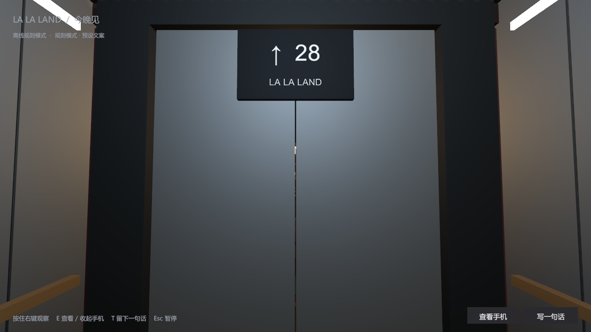
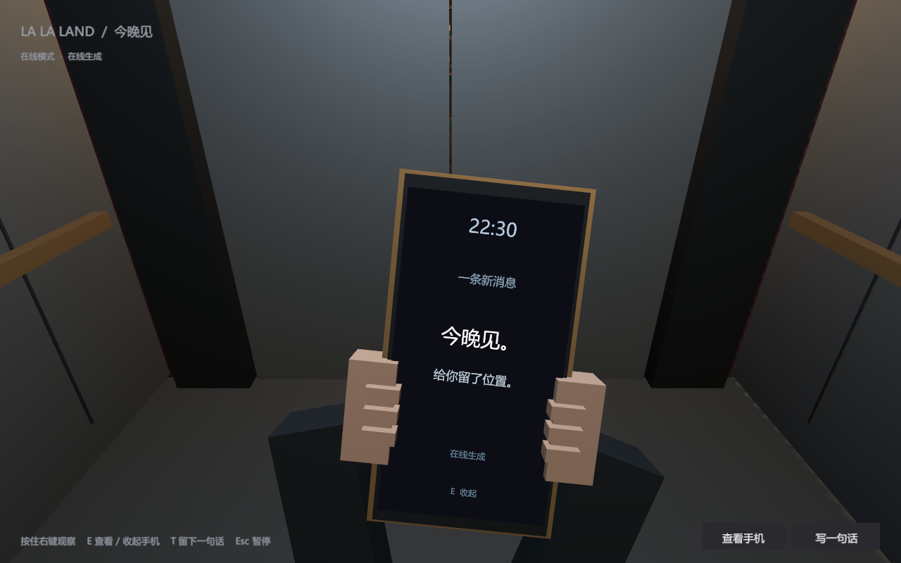
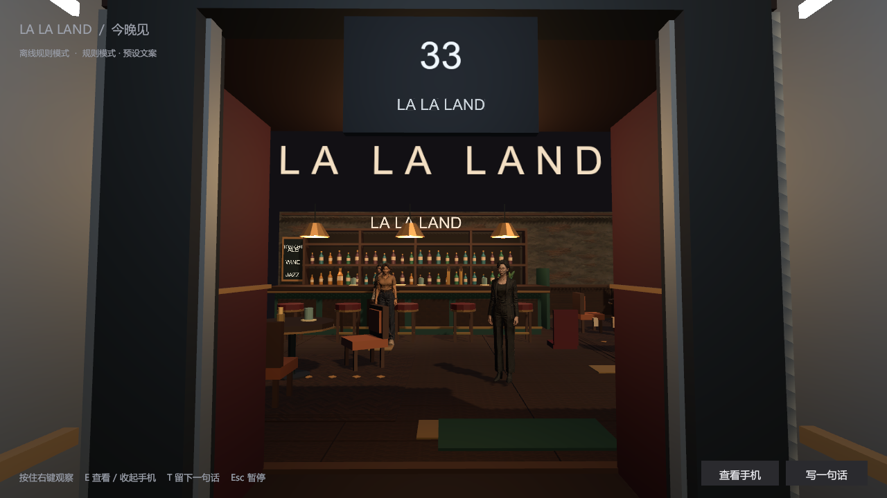

# Scene 0「电梯上升：今晚见」交付与验证

日期：2026-08-28。目标工程：LALAGAME/LALAGAME/BarPrototype；团结引擎 2022.3.62t14、URP、Windows x64。

## 本轮完成

同一个 LastCall 场景中加入独立可编辑电梯 Prefab、短门厅、连续地面和边界、冷暖灯光过渡、双扇滑门、第一人称手袖与 3D 手机。七秒开场完成后交还原有第一人称操作和酒吧交互，没有复制第二套酒吧或重写 Scene 1。

保留原角色 FBX、材质贴图、灯光和未提交改动。角色与舞台贴图通过 ArtCatalog 序列化，Windows 包使用与编辑器一致的资源。修复原 TextMesh 穿墙显示；仅更新新增门厅边界，不运行旧的整场重建 Prepare。

五种身份和参与意愿保留；增加三种赴约方式与可选背景。新建世界播放开场，A/B/C 在场、D 条件出现；旧世界保持原入场逻辑，下一晚不重播。首次交互前显示「眼镜来客／浅衣来客／侧廊来客」，不改变角色已有关系知识。

后台开场单独计时，只产生一次 B→调酒师的预期客人事件。A 获取片段听闻，C 获取可见动作，玩家不能读取原文与私有解释。输入文字仅保存玩家当下状态，不自动传播。手机内容、阅读状态、时间节点和事件去重随存档恢复。

在线使用既有网关、gpt-4.1-mini 和本机私有配置；短消息在安全短句范围内生成。2.3 秒展示节点前未就绪、校验失败或网络异常均标记为预设文案；迟到结果不能改写已展示消息。开场调用计入原预算，不更换模型。

## 自动化与实机结果

后端：55 / 55 通过，记录 `scene0-backend.xml`。包括旧存档兼容、唯一后台事件、A/C 不同感知及遮挡、玩家文本隔离、重复命令、七秒计时、后端真实进程重启、下一晚、迟到模型结果、非法字段与身份泄漏拒绝。

编辑器：20 / 20 通过，记录 `scene0-final-editmode.xml`。包括原工程回归，以及六名角色的序列化模型和贴图、音频引用、连续地面、门关闭时阻挡／打开后通行、前边界、无丢失脚本或错误着色器。

实际启动完整 Windows exe，自动启动随包 Node 服务，保存并正常退出。各运行均为 14 / 14 检查通过、0 个运行错误。

| 实机记录 | 模式 / 文案 | 自动入场 | 平均 FPS（5 秒采样） |
|---|---|---:|---:|
| scene0-delivery-720，1280×720 | 离线 / 预设 | 7.369 秒 | 59.96 |
| scene0-online-800，1280×800 | 在线 / 模型生成 | 7.381 秒 | 59.98 |
| scene0-final-1080，1920×1080 | 离线 / 预设 | 7.249 秒 | 59.98 |

硬件：NVIDIA GeForce RTX 4070 Laptop GPU。以上是开场进入酒吧后的短时采样，不是整晚性能保证；引擎已限制目标 60 FPS。

实机检查覆盖：服务启动、A/B/C 与 D 状态、开场隐藏牌和事件、营业时钟冻结、7 秒自动交接、模型加载、开门后低通参数解除且音频播放、W 移动恢复、中文文本及移动冻结、私有文字保存、暂停、中途同世界恢复、失焦暂停及继续开门。测试输入为合成数据，使用独立测试数据库，不操作玩家已有存档。桌面意外失焦后测试器会显式恢复；正式游戏仍保持暂停。

网关真实兼容检查见 `scene0-gateway.json`：JSON 与业务校验通过，使用一次请求；另一次原生在线开场也在截止前获得合规消息。此前实验中网关曾给出超长或无关内容，已验证会回退，不把所有可解析 JSON 当作合法文案。

依据 OpenAI Docs 技能核对的 [Structured Outputs / JSON mode 官方说明](https://developers.openai.com/api/docs/guides/structured-outputs)，实现分别检查 JSON 格式和业务结构；第三方网关的真实兼容性以上述本机结果为准。

## 可复现演示

1. 完整解压独立验证包，运行 `LastCall.exe`。默认 1280×720 可调整窗口。
2. 保持「熟人来客／朋友邀约」，可选在线或离线，点击「进入电梯」。不操作即可看到冷白电梯 → 手机「今晚见」→ 抬头 → 暖色酒吧 → 原有交互界面。
3. 新开局在电梯按 T，输入一句话；观察门和镜头停止推进，提交后继续。Esc 可保存并退出，再启动选择继续已有夜晚。
4. 入场后 WASD 移动，选择人物靠近并交互，观察外观提示恢复为原称呼；调酒师的预点酒事件此时才出现。

原生截图位于上述三组目录：entry、elevator、phone、doors、threshold、bar、text-input。截图直接来自运行包，没有生成或修饰。

## 验证边界与后续人工体验

- 本轮是 Scene 0 交付；没有重新完成或宣称整局 12 分钟 Scene 1 全路径人工验收。
- 自动化注入中文并检查输入冻结，不等同于逐一测试 Windows 拼音候选窗、各类输入法及键盘布局。E、点击手机、右键观察的绑定与状态路径已实现，仍建议用真实鼠标键盘完整体验一次。
- 音频资产、播放和 520→18000 Hz 低通过渡已检查；没有用真人试听代替自动化结果，最终响度／笑声存在感需要按实际耳机或音箱确认。
- 保留最新工程原有角色／家具风格。手与电梯为本轮自制低多边形模型，不是预渲染影片，也不假称最终商业美术。

## 隐私与交付

编辑场景：`Assets/Scenes/LastCall.unity`；独立 Prefab：`Assets/LastCall/SceneZero/SceneZero.prefab`。

完整运行目录：`Builds/Scene0-Windows`；独立压缩包：`Builds/LALAGAME-Scene0-Windows-20260828.zip`。没有覆盖此前发布目录，也没有自动推送 GitHub。

包仅含运行时、素材、音频许可、中文说明、合成测试结果和截图；排除 DoNotShip 调试符号、日志、密钥、存档、聊天记录和原始私人文档。运行树逐字节密钥检查见 `scene0-package-audit.json`，不输出密钥内容。

音频：原创合成电梯／震动／到达／门／杯／音乐，以及 CC0 女声短笑；来源与许可见 `Assets/LastCall/SceneZero/Audio/LICENSES.md`。无商业歌曲，无麦克风录制。
