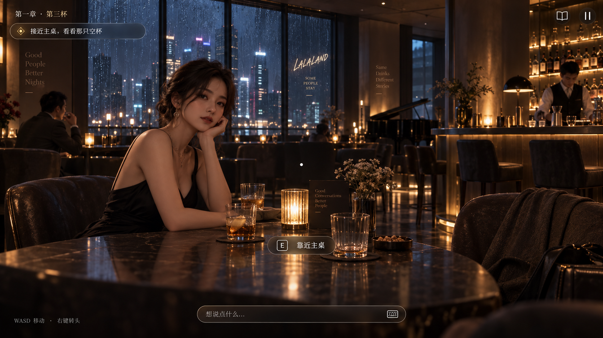
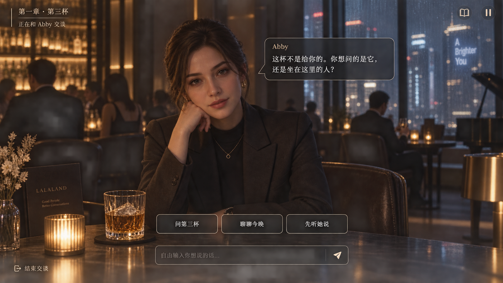

# Lalaland 极简交互方向稿

> 本目录只用于确认交互方向，暂未接入 Unreal。模拟图中的人物与场景不是最终资产，正式实现继续使用现有 A–D 模型和实际酒吧关卡。

## 设计目标

画面与人物始终处于第一层，剧情目标位于第二层，玩家操作只在需要时出现。常态不再铺开“观察 / 移动 / 互动”菜单，也不显示卡牌栏或大段事件记录。

永久可见的内容只有：章节目标、中心注视点、折叠的自由输入入口，以及线索册和暂停两个系统图标。

## 状态一：自由探索

- `WASD` 直接移动，右键转头，不再打开移动菜单。
- 注视人物、杯子、椅子或门时，画面一次只显示一个最合适的情境动作，例如“靠近主桌”“和 Abby 交谈”“坐下”。
- 同一对象存在多个动作时，先执行默认动作；长按 `E` 或鼠标滚轮才展开最多三个同级动作。
- 自由输入条默认折叠，按 `Enter` 展开并自动绑定当前注视人物；没有明确人物时先让玩家选择目标，不广播给所有 NPC。

## 状态二：定向对话

- 镜头轻微对准目标，目标角色成为唯一回答者；其他 NPC 只能旁听并形成自己的感知事件，不得插嘴。
- NPC 对白显示在头部附近，玩家输入固定在下方。
- 每轮最多提供三个短意图，例如“问第三杯”“聊聊今晚”“先听她说”。它们是快捷入口，不是通关密码。
- 自由输入与快捷意图同级，始终可以使用。发送后只锁定当前一次请求，回复或错误结束后重新开放。
- 点击快捷意图后立即变灰，同一轮不能重复发送。AI 失败时恢复可用并保留玩家原话。

## 状态三：剧情选择与下一步

- 普通剧情不弹选择框，满足条件后把当前情境动作替换成唯一高亮的“下一步”，例如“回到主桌”“进入走廊”“上楼”。
- 只有存在真实分支时才显示选择组，一次最多三个平级选项，例如断电后的“上楼 / 留下 / 离开”。
- 选择后整组收起，已选结果变为一行轻量状态，避免按钮长期占据画面。
- 对话失败、角色沉默、只旁观或不参加活动都不能卡住章节计时和主线转场。

## 三页入场

入口仍保持一页一个问题，但每页只露出三个推荐答案；其余答案放入同一行横向选择器，不增加新的菜单层级。“跳过”作为右下角文字操作，不与主要答案竞争视觉焦点。返回上一页时保留选择。

## Scene 0–6 映射

| 章节 | 主情境动作 |
|---|---|
| Scene 1 | 靠近主桌 → 查看第三杯 → 与一人交谈 → 等待来客 |
| Scene 2 | 自由交流；夜深后唯一高亮“回到主桌”，随后自动进入塔罗 |
| Scene 3 | 入座 / 旁观 / 不参加三选一；每轮最多三个回应意图并保留自由输入 |
| Scene 4 | 注视侧门出现“跟出去”；不操作即自然留在酒吧，走廊里按物件触发私聊 |
| Scene 5 | 断电后只显示“上楼 / 留下 / 离开”三项 |
| Scene 6 | 姿态使用情境动作切换；“结束这一晚”持续可见但不催促 |

## 实现边界

- 不复制其他游戏的具体图标、排版或素材，只采用“画面优先、操作按需出现”的交互原则。
- 不删除自由输入、线索册或存档功能。
- 不让 UI 自己推进剧情；情境动作仍调用服务端验证过的命令。
- 不通过按钮自动泄露姓名、秘密或未被玩家感知的事件。
