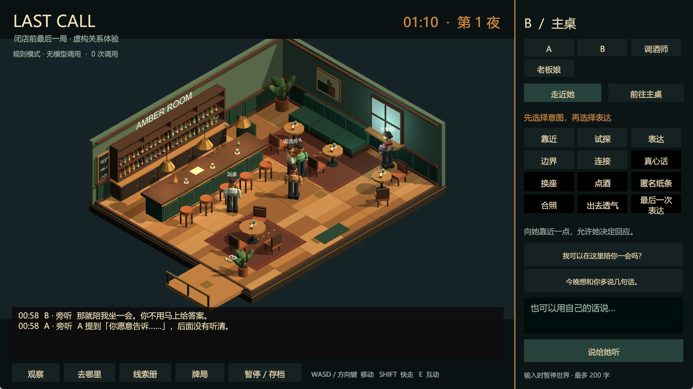
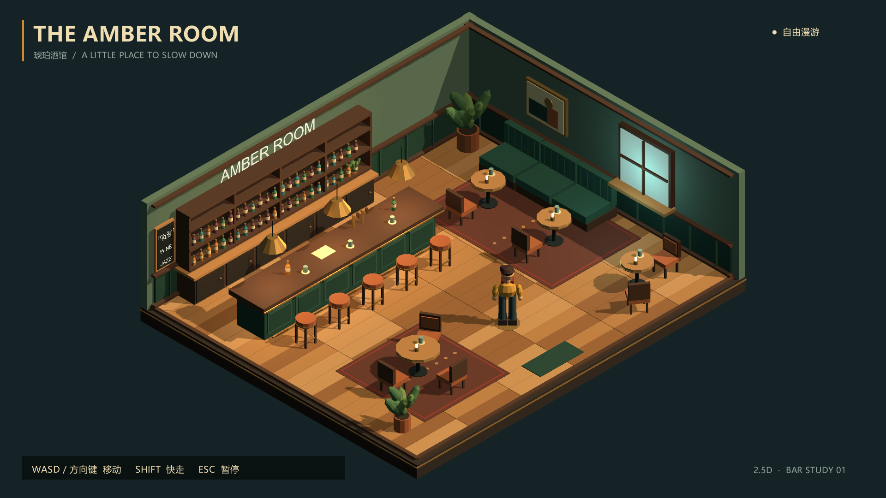

# LALAGAME
LALA game

## Last Call · 关系体验 MVP

新增可从入场、交流、设界限玩到离场回看的单机关系体验。保留原琥珀酒馆漫游场景。



- [Windows 完整运行包](https://github.com/babasoumah702-rgb/LALAGAME/releases/tag/lastcall-v0.2.0)：解压后运行 LastCall.exe，无需安装开发工具。
- [中文启动说明与演示路线](BarPrototype/LASTCALL_启动说明.md)
- [测试报告](BarPrototype/Verification/LASTCALL_测试报告.md)
- [本地后端架构](BarPrototype/Server/ARCHITECTURE.md)
- 编辑工程：团结引擎 2022.3.62t14，打开 BarPrototype/Assets/Scenes/LastCall.unity。
- 后端：Node 24.12.x，在 BarPrototype/Server 中执行 npm ci 和 npm run build。

五种入口、A/B/C/D 条件关系内容、独立感知与记忆、12 张社交卡、中文输入、暂停、存档和回看。
支持兼容模型网关和明确标识的离线规则模式。API 密钥、玩家存档及私人附件不在仓库或运行包中；离线游玩不需要密钥。

验证：41 项后端测试、14 项编辑器测试通过；离线续玩到自然闭店 12 项实机检查通过，最终在线窗口 9 项检查通过。详细范围与未覆盖项见测试报告。

## 琥珀酒馆 / The Amber Room

固定斜俯视、低多边形 2.5D 酒吧漫游原型。WASD / 方向键移动，Shift 快走，Esc 暂停 / 继续。



- [工程与中文说明](BarPrototype/README.md)
- [测试报告与验收边界](BarPrototype/Verification/STATUS.md)
- 编辑器版本：团结引擎 **2022.3.62t14**；URP **14.2.0-t1**。
- 在团结 Hub 中添加仓库内的 `BarPrototype` 文件夹，打开 `Assets/Scenes/AmberRoom.unity`。
- 编辑器菜单 `Amber Room > 2 - Build Windows game` 可生成 Windows 程序。

仓库包含源代码、场景、角色 Prefab、材质、截图及测试结果，不含 Library 缓存、本地日志和 Windows 二进制构建产物。

在仓库根目录也可通过 PowerShell 运行重建脚本；路径与本机不同时指定编辑器位置：

```powershell
.\Tools\Build-Bar.ps1 -Action Test -EditorPath 'D:\unity cn\Editor\Tuanjie.exe'
.\Tools\Build-Bar.ps1 -Action Build -EditorPath 'D:\unity cn\Editor\Tuanjie.exe'
.\Tools\Build-Bar.ps1 -Action Smoke
```

已有场景可直接编辑，无需执行 Prepare。Prepare 会覆盖自动生成资产，手工修改后请先备份。
